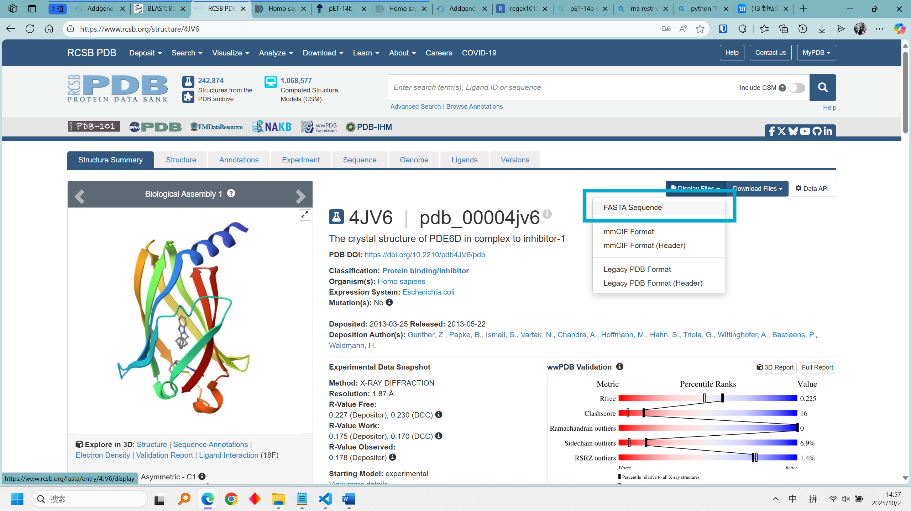
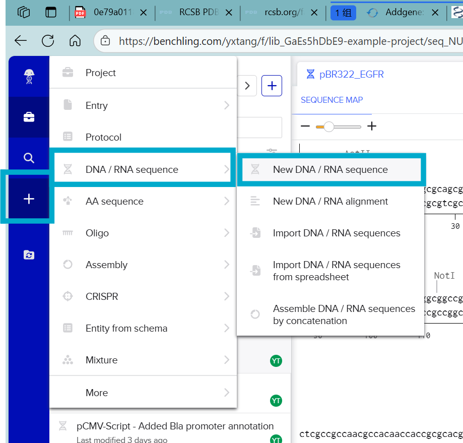
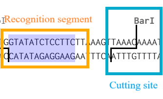
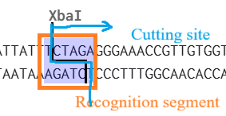

# Clone and Expression

The very basic procedure is to find out the gene sequence expressing the protein we want to clone, and to insert the gene sequence into specific vector.

## Protein Sequence to Gene Sequence

### Obtain the Protein Sequence in PDB

So we get the protein FASTA sequence.

More information about the protein sequence are available in the Sequence Tab or Uniprot.

### BLAST Protein to Gene

The BLAST tool used here is tblastn, which 'translate' protein sequence into nucleic acid sequence.

Remember to change `Database` to `RefSeq Select RNA sequences (refseq_select)`.

In the new page facts such as biological role, Function/mechanism, Tissue of origin, Disease relevance/known mutation can be found. This time, we just focus on its GeneBank **accession**.

Note that, entries start with accession *NM_* indicates that they are mRNA. The whole sequence structures in these entries can be represented in following figure:

Those entries starting with *NG_* or *NC_*, which contain introns, refer to *genome reference sequences* and *chromosome sequences*.

Focus on belowing fields in the new page:

**Gene**: click 'gene' will show you a whole gene sequence at the bottom of the page.

**Exon**:  click 'exon'. Some part of gene sequence will be highlighted.

**CDS**: click 'CDS' (codons). Highlighted part reflects what is translated by a ribosome. The sequence starts with a start codon and terminates with a terminating codon. We can also find a translated protein sequence as well at the left bottom area.

What we want in this job is the codon sequence, since some genomic fragments in the whole gene or exons do not express protein, clicking `Display: FASTA` enable us to copy the codon sequence.

Now, we have finished all preparation steps. We will move to [Benchling Lab](https://benchling.com/) and start inserting the obtained gene sequence into a vector.

## Obtain Vector Sequence

The vector is firstly obtained via [Addgene](www.addgene.org). Search the vector we want and copy the sequence.

## Insert Sequence into Vector in Benchling Lab

Go back to [Benchling Lab](https://benchling.com/), and create a new DNA sequence.

### Add Annotations

Some annotations can be added automatically, or add them manually according to instructions.

### Insertion

The recognition segment and the cutting cite show when hovering mouse over a restriction enzyme name.

One critical point to be aware of is how to select the right place to insert gene.

Taking the second restriction enzyme as an example, purple highlighted area is the enzyme recognition segment, with a zig-zag solid line referring to the cutting site.

#### Insertion Location

The insertion of nucleic acid sequence must locates at the right side of `A-T` pair or the left side of `T-A` pair on the margin of the recognition segment, in spite that the cutting is irrelevant with `T-A` and `A-T`, due to the insertion within recognition segment may 'damage' the recognition segment.

#### Avoid self-rejoin

Another point is that both terminals of the cutting site should not be compatible with each other, aiming to avoid tshe self-rejoin of plasmid terminals

#### Avoid frame-shift mutation

Moreover, the inserted nucleic acid sequence must line up with the ORF and has a sequence length of $3n$ so there is no 'frame-shift' mutation

#### Optimize Inserted Codons

>One important consideration is that the insert should not be cut by the restriction enzymes that will be used in cloning.
>If we are getting the coding sequence synthesised, we can do two things at once: make sure that the codons that are being used give the protein the best chance at high expression, and avoid sites recognised by restriction enzymes we are planning on using.

Two objects:

- Make sure there is no restriction enzyme recognition sites.
- Balance the bases usage.

Note that, the optimised codons will not replace the original codons automatically. Copy optimised codons and substitude the original codons to apply the optimisation.

### Add Kozak consensus sequence

>Efficient initiation of translation in eukaryotes requires the presence of the Kozak consensus sequence, most commonly GCCGCCACCAUGG where ‘AUG’ corresponds with the start methionine ATG codon. This particular plasmid lacks this sequence, so we can add it by placing the cursor before the start codon and typing GCCGCCACC without anything else selected.
