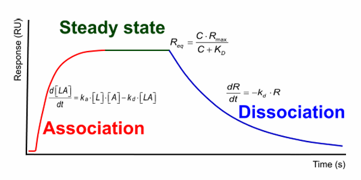
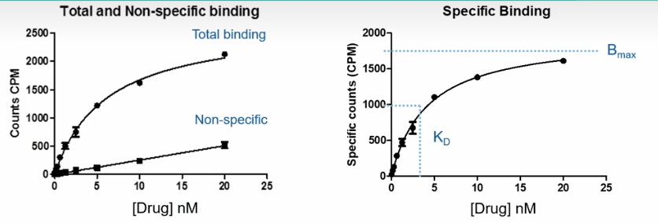
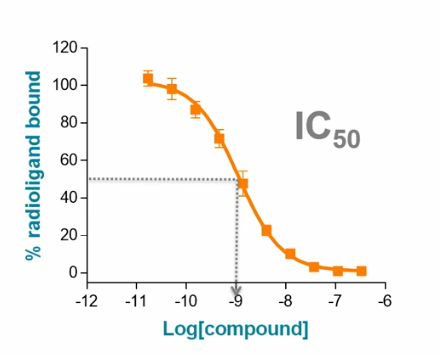
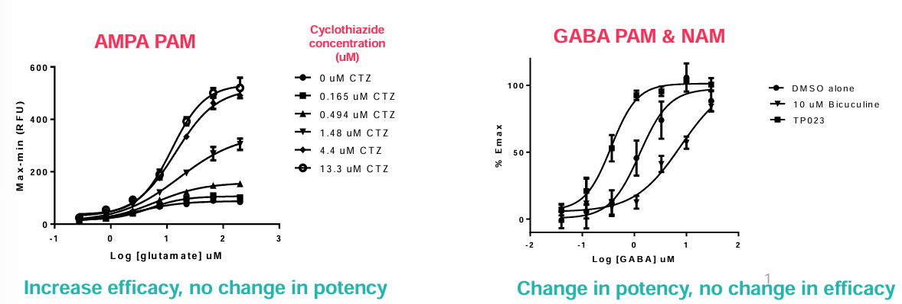
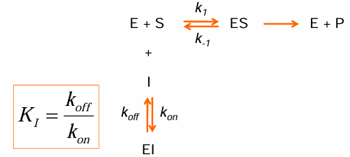

# Pharmacology of the main drug targets

## Find a Druggable Target

### Druggable

- Ligands can get into the binding site. (Considering the hydrophilicity balance, neither too hydrophilic nor too hydrophobic).
- Containing a binding site, with high drug binding affinities (affinity means the degree of firmness the ligand binds to the protein).
- The binding must elicit a response. (efficacy)

## Common Drug Targets

|

### **Ion Channels**

This kind of drug targets are often located in the CNS and used to pain control.

### **GPCR**

G protein-coupled receptors (GPCRs), are a series of transmembrane receptors coupling with G proteins[^1].

#### Quick Facts

- **Location**: on the plasma membrane.
- **Ligands** including peptides, hormones, photons, ions, and small molecules.
- GPCRs are **targets of 30% drugs**.

#### Signaling

Two features of GPCRs are expected to be focused:

1. Desensitisation: when signals are too high, cells internalise and recycle GPCRs to desensitise itself.
2. Biased agonism: The activation of a certain kind of G protein by one agonist may generate signals participating in many downstream pathways, which further account for **on-target** side effect. 

### **Enzymes**

#### Quick Facts

- Location: Soluble or membrane bound
- The most common type transfers phosphate and trigger cascade signalling.
- Ligands can interact the plasma-side of enzymes located on cell membrane, and create reactions inside of the cytosol.

### **Protein-Protein Interactions for Signalling**

#### Protein-Protein interaction can transduct signals

>Protein-protein interactions occur for signal transduction & some enzymes are only active as multimeric complexes.

#### Drugs Targeting on Protein-Protein Interactions

Since interacting proteins may have  very large scales, drugs designed to involve (inhibit or stablise) in this process may also have a very large size.

This obviously does not comply Lipinsky rule-of-five. Drugs can be hard to be absorbed.Hence,  some focus on designing drugs in reasonable sizes (such as some cyclic peptides) or take peptic compounds in terms of small molecules.

In another aspect, drugs are also designed to **increase binding** affinities between proteins through allosteric effect or acting as the interface.

## **Receptor Pharmacology**

### Affinity

Affinity describes the process how drugs bind to their receptors:

$$
Drug + Receptor \rightleftharpoons_{K_{off}}^{K_{on}} Drug-Receptor Complex
$$

More specifically, the whole process can be described as **Association**, **Steady state**, and **Dissociation**. <b>Among these different stages, dissociation stage represents affinities between drugs and receptors.</b>

Note that, there are three equations on the figure:

Association rate:
$$
\frac {d[LA]} {dt} = k_a \cdot [L] \cdot [A] - k_d \cdot [LA]
$$

where $k_a$ and $k_d$ denotes the association *rate* constant and dessociation *rate* constant, respectively. $k_a \cdot [L] \cdot [A]$ represents the actual association rate, while $k_d \cdot [LA]$ represents the actual dissociation rate.
The longer the dissociation state lasts, the higher affinity of drug has to its target.

#### Meaning of Affinity

Higher affinity also means the lower dosage and administration frequency are needed. These outcomes benifit in terms of decreasing off-target effects, achieving long-term actions, improving patient compliances.

#### Quantitative Description: Dissociation Constant $K_D$

### Efficacy

Efficacy describes to what extent responses are elicited after the binding occurs.

*Binding* does not mean response. But if a drug show efficacy, it must bind somewhere.

Sometimes we do not want a very high efficacy aiming to get rid of side effects.

### Potency

Potency is a measure of necessary amount of the drug to produce an effect of a given magnitude.

 Potency depends on both <b>affinity</b> and <b>efficacy</b>

In general cases, **potency** lines up with **affinity**. If they are a long way different, it suggests there's a problem somewhere in one of the sites is not correct.

#### Quantitative Description: $IC_{50}$ and $EC_{50}$

$EC_{50}$ is the concentration of drug required to elicit a 50% response and reflects the potency of the given drug.

 Smaller $EC_{50}$ values indicate stronger potency

Plot $\log[Compound]$ against bound percentage and end up with a -1 slope (usually $k \in \{0.5, 2\}$) sigmoidal curve.

To get the maximum inhibitory concentration, you need to know what your inhibited enzyme is looking like, which might be challenging.

## **Ligand View**

### **Full and Partial Agonist**

Full agonist elicit 100% efficacy, while partial agonist are weaker in terms of efficacy. (There is nothing to do with potency)

### **Antagonist**

Antagonists do not trigger **any** effect.

#### Competitive vs Non-Competitive Antagonist

The situation in `Agonist + Non-Competitive Antagonist` is a little bit similar to that in `Full Agonist vs Partial Agonist`, in which efficacy is reduced and potency remains the same.

### **Inverse Agonist**

Sometimes, there are might be some receptors (GPCRs or mutation-induced) are *instrinsic active*, which means they exhibit activities even there is no agonist. In this case, **inverse agonists** bind to inhibit the baseline activity.

### **Positive/ Negative Allosteric Modulaters**

- Allosteric modulators have no effect on their own, but enhance or reduce the effect of agonists.
- PAMs enhance effect of agonist
- NAMs reduce effect of agonist
- Allosteric binding sites will not be distant away from original binding sites.

The results of efficacy and potency shifts can be diverse:

## **Enzyme Pharmacology**

### Reaction Rate

The measurement of reaction rate assuming the experimente system neither runs out of substrates nor has an abundance of substrate. (Measurements start at the point where 10% substrate is depleted.) This ensures the accuracy and sensitivity of assay.

Reaction rate and some constants can be figured out through this equation and experiment data.

$$
v = \frac {V_{max} \cdot [S]} {[S]+K_m}
$$

where $v$ denotes the reaction rate, $v_{max}$ denotes the maximal reaction rate, and $K_m$ denotes the  concentration of the substrate when reaction reaches half of $v_{max}$ (**Michaelis constant**)

Linearisation of Michaelis-Menten curve is based on some prerequisites, which may incur error. Only linearise data when checking its quality.

### View inhibitors from Michaelis-Menten Equation

|Inhibitor Type|$V_{max}$|$K_m$|
|:---:|:---:|:---:|
|Competitive Inhibitor|/|$\uparrow$|
|Non-competitive Inhibitor|$\downarrow$|/|
|Uncompetitive Inhibitor*|$\downarrow$|$\downarrow$|

*: Uncompetitive inhibitors interact with the $E-S$ complexes, which both hinders productions of product and dissociations.

Persumably, the interaction site is known, and drugable. A competitive inhibitor might be a good choice. Whereas in the condition that the interaction site is not drugable, having poor hydrophilic property for example. Allosteric (Non-competitive) inhibitors are good alternatives.

In terms of competitive inhibition:

smaller off-rate $k_{off}$ indicates a longer effect.

#### Time-dependent Inhibition

The  $k_{off}$ values of time-dependent inhibitors change with respect to time. According to the equation $K_f = \frac {k_{off}} {k_{on}}$, their  inhibition capabilities increase, which further reflect changes in their  potency.

In this case, the original metrics like $k_a$ and $k_d$ are meaningless.

[^1]: G proteins contain 3 subunits, $G_\alpha$, $G_\beta$, and $G_\gamma$. Among these subunits, $G_\alpha$ is the most investigated and in charge of cascade signal transduction. $G_\beta$ and $G_\gamma$ can signal as a dimer.
